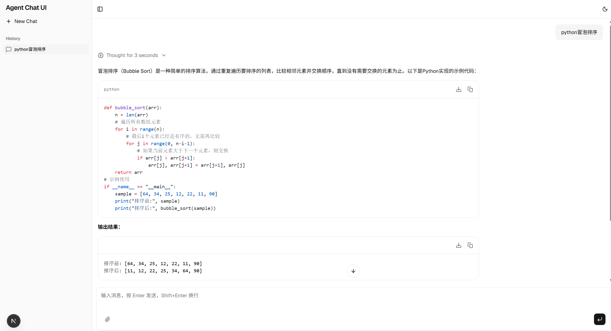
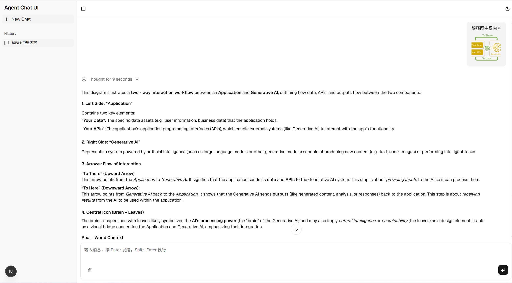
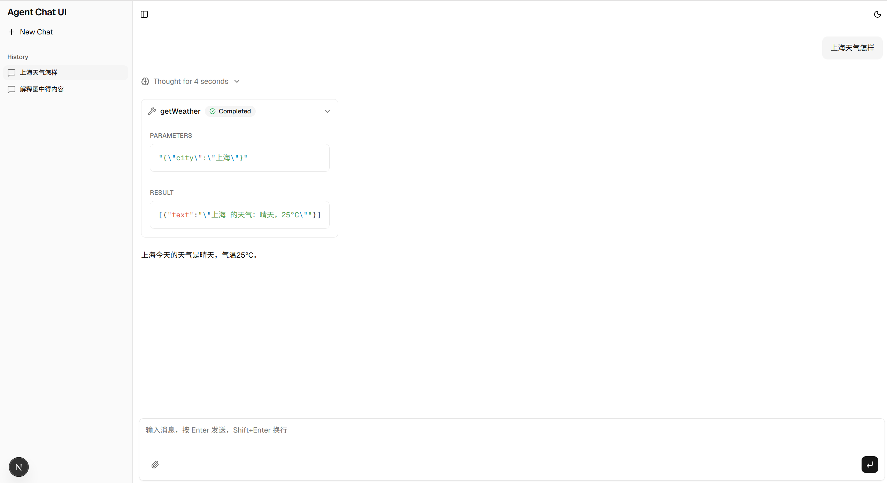

# AgentScope Chat

一个基于 Spring Boot 后端集成 [AgentScope](https://github.com/modelscope/agentscope) 和现代 Next.js 前端的全栈 AI 聊天应用。

<div align="center">
    
    
    
</div>

## 🚀 功能特性

- **实时流式响应**: 基于 Server-Sent Events (SSE) 的聊天响应流。
- **Agent 集成**: 基于 AgentScope 构建，支持灵活的 Agent 编排（当前示例使用 DashScope/Qwen）。
- **现代化 UI**: 使用 Next.js 16、Tailwind CSS 和 Shadcn UI 构建的整洁、响应式界面。
- **富文本支持**: 支持 Markdown 渲染、代码块高亮和文件附件。
- **会话管理**: 支持创建和切换多个聊天会话。
- **主题支持**: 内置深色/浅色模式切换。

## 📂 项目结构

- **`agentscope-chat-core`**: 包含 AgentScope 集成的 Spring Boot 控制器和服务逻辑的核心库。
- **`agentscope-chat-ui`**: 基于 Next.js 构建的前端应用。
- **`example`**: 一个演示如何使用核心库并配置具体 Agent 的 Spring Boot 示例应用。

## 🛠 前置要求

- **Java**: JDK 17 或更高版本。
- **Node.js**: Version 20 或更高版本 (推荐用于 Next.js 16)。
- **Maven**: 用于构建后端。
- **API Key**: 有效的 [DashScope API Key](https://help.aliyun.com/zh/dashscope/developer-reference/activate-dashscope-and-create-an-api-key)。

## 🏃 快速开始

### 1. 后端 (示例应用)

`example` 模块提供了一个可直接运行的后端示例。

1.  **设置 API Key**:
    你需要设置 `DASHSCOPE_API_KEY` 环境变量。
    
    **Windows (PowerShell):**
    ```powershell
    $env:DASHSCOPE_API_KEY="sk-..."
    ```
    
    **Linux/macOS:**
    ```bash
    export DASHSCOPE_API_KEY="sk-..."
    ```

2.  **运行应用**:
    在项目根目录下运行：
    
    ```bash
    ./mvnw -pl example spring-boot:run
    ```
    
    后端服务将启动在 `http://localhost:8080`。

### 2. 前端 (UI)

1.  **进入 UI 目录**:
    ```bash
    cd agentscope-chat-ui
    ```

2.  **安装依赖**:
    ```bash
    npm install
    # 或
    yarn install
    # 或
    pnpm install
    ```

3.  **启动开发服务器**:
    ```bash
    npm run dev
    ```

    应用将运行在 `http://localhost:3000`。

## ⚙️ 配置说明

### 前端配置

你可以通过设置环境变量来配置前端（在 `agentscope-chat-ui` 目录下创建 `.env.local` 文件）：

| 变量名 | 描述 | 默认值 |
| :--- | :--- | :--- |
| `NEXT_PUBLIC_API_URL` | 后端 API 的基础 URL。 | `http://localhost:8080` |
| `NEXT_PUBLIC_AGENT_NAME`| 默认使用的 Agent 名称。 | `default_agent` |

### 后端配置

后端示例使用 `CustomerAgentLoader.java` 来加载 Agent。默认情况下，它配置为：
- 模型: `qwen-flash`
- Agent 名称: `default_agent`

你可以修改 `example/src/main/java/io/github/renpengben/agentscope/chat/example/CustomerAgentLoader.java` 来更改模型或 Agent 逻辑。


